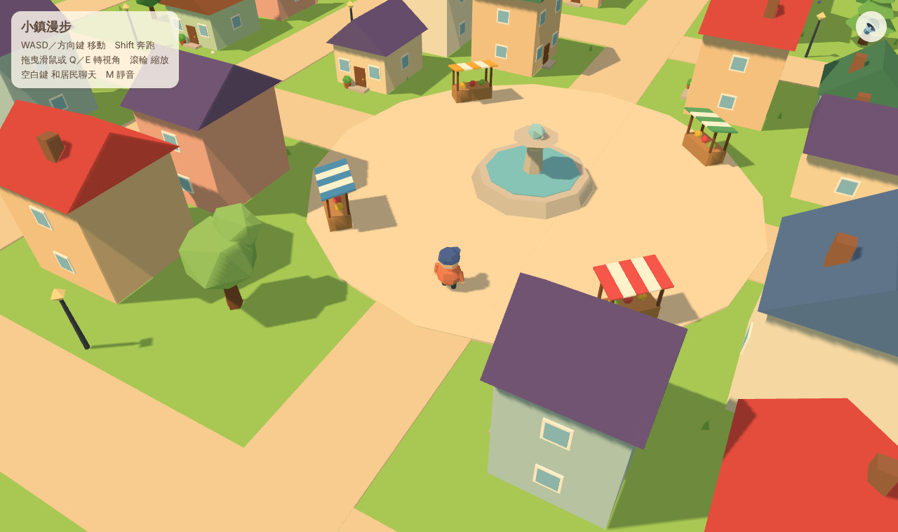

# Town Explorer

A small low-poly, cartoon-style town you can wander around in the browser.
Built with [Three.js](https://threejs.org/) and [Vite](https://vitejs.dev/), inspired by the mood of [Messenger](https://messenger.abeto.co/).



## Features

- A medium-sized island town: fountain plaza with market stalls, parks, a pier with a little boat, and a lighthouse
- Chubby low-poly character with a smooth third-person follow camera
- Villagers who wander the streets and stop to chat when you walk up to them
- Procedural ambience (waves, birds, a quiet music-box melody, footsteps) with a mute toggle
- Everything is generated in code: no external models, textures or audio files
- Houses and trees between the camera and the player turn see-through so you never lose your character

## Controls

| Action | Desktop | Mobile |
| --- | --- | --- |
| Move | WASD / arrow keys | Drag on the left half of the screen |
| Run | Hold Shift | Push the joystick all the way |
| Rotate camera | Drag with the mouse, or Q / E | Drag on the right half of the screen |
| Zoom | Mouse wheel | – |
| Talk | Space / Enter near a villager | Tap the "聊天" button |
| Mute | M or the speaker button | Speaker button |

## Getting started

```bash
npm install
npm run dev      # start the dev server
npm run build    # production build into dist/
npm run preview  # serve the production build
```

Handy for testing: URL parameters `?x=0&z=100&yaw=0.6&dist=22` set the starting position, camera angle and distance.

## Deploying to GitHub Pages

The workflow in `.github/workflows/deploy.yml` builds and deploys on every push to `main`.
Enable it once under **Settings → Pages → Build and deployment → Source: GitHub Actions**.

## Project layout

```
src/
  main.js        renderer, lights, camera, game loop and UI
  town.js        procedural town: island, roads, houses, parks, pier, lighthouse
  character.js   low-poly character builder and walk animation
  villagers.js   wandering NPCs and their dialogue lines
  physics.js     circle-vs-collider movement with sliding
  input.js       keyboard, mouse and touch joystick
  audio.js       Web Audio ambience and footsteps
  materials.js   toon materials, faceted geometry helper, see-through cutout
```

`character.js` only exposes `root`, `animate()` and `height`, so the procedural
character can later be replaced by a glTF model without touching the rest of the game.
